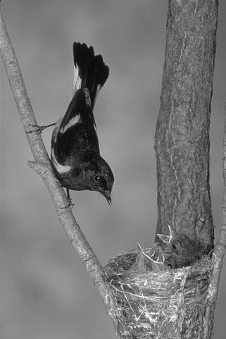
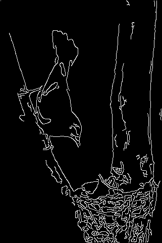
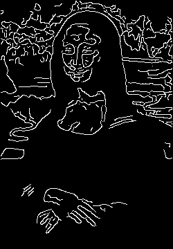

# Edge Detector

This project implements a full Canny-style edge detector in C++ without third-party libraries.

## Structure

```text
Final_Project/
├── CMakeLists.txt
├── README.md
├── image/
│   ├── bird.png
│   └── mona_lisa.png
├── include/
│   ├── gaussian.hpp
│   ├── hysteresis.hpp
│   ├── image.hpp
│   ├── image_io.hpp
│   ├── nms.hpp
│   ├── sobel.hpp
│   └── threshold.hpp
├── input/
│   ├── bird.pgm
│   └── mona_lisa.pgm
├── output/
│   ├── bird_edges.pgm
│   ├── bird_edges.png
│   ├── mona_lisa_edge.pgm
│   └── mona_lisa_edge.png
└── src/
    ├── gaussian.cpp
    ├── hysteresis.cpp
    ├── image_io.cpp
    ├── main.cpp
    ├── nms.cpp
    ├── sobel.cpp
    └── threshold.cpp
```

## Supported input/output

- Input: `PGM` grayscale images (`P2` ASCII or `P5` binary)
- Output: `PGM` grayscale edge image

`PGM` was chosen deliberately because this project avoids third-party libraries and needs full visibility into each processing stage. Compared with formats like `PNG` or `JPEG`, `PGM` is simple to parse manually, maps directly to grayscale edge detection, and keeps the implementation focused on the actual algorithm rather than external image-decoding complexity.

## Pipeline Overview

The edge detector follows a full Canny-style pipeline composed of five sequential stages:

### 1. Gaussian Blur

The input image is first smoothed using a Gaussian filter to reduce noise. Instead of using a full 2D kernel, the implementation uses a **separable Gaussian**, applying a 1D kernel horizontally and then vertically. This produces the same result as a 2D Gaussian filter while keeping the implementation simple and structured. The amount of smoothing is controlled by the kernel size and the standard deviation σ.

---

### 2. Sobel Gradient Computation

The smoothed image is processed using Sobel operators to compute image gradients in the x and y directions. From these, two quantities are derived for each pixel:

- **Gradient magnitude**: indicates the strength of an edge  
- **Gradient direction**: indicates the direction of intensity change  

The direction is quantized into four discrete angles (0°, 45°, 90°, 135°) to simplify later processing.

---

### 3. Non-Maximum Suppression (NMS)

The gradient magnitude image typically contains thick edge responses. Non-maximum suppression thins these edges by keeping only pixels that are local maxima **along the gradient direction**. For each pixel, its magnitude is compared with two neighboring pixels aligned with its direction. If it is not the maximum, it is suppressed to zero. This produces thin, one-pixel-wide edge candidates.

---

### 4. Double Threshold

The suppressed image is classified into three categories using two thresholds:

- **Strong edges**: magnitude ≥ high threshold  
- **Weak edges**: low threshold ≤ magnitude < high threshold  
- **Non-edges**: magnitude < low threshold  

This step separates confident edges from uncertain ones while discarding clear noise.

---

### 5. Hysteresis

Hysteresis finalizes the edge map by preserving only meaningful edge structures. Starting from all strong edge pixels, a breadth-first search (BFS) is performed using 8-connectivity. Any weak pixel connected to a strong edge is promoted to a strong edge. All remaining weak pixels are discarded. This ensures that edges are continuous while removing isolated noise.

---

## Build

```powershell
cmake -S . -B build
cmake --build build
```

## Run

```powershell
.\build\edge_detector.exe input.pgm output.pgm --low 40 --high 100 --kernel 7 --sigma 1.4
```

WSL/bash:

```bash
./edge_detector input.pgm output.pgm --low 40 --high 100 --kernel 7 --sigma 1.4
```

Example:

```bash
./edge_detector input/bird.pgm output/bird_edges.pgm --low 40 --high 100 --kernel 7 --sigma 1.4
```

In this example:

- Input image: `input/bird.pgm`
- Output edge image: `output/bird_edges.pgm`

Input image:



Output edge image:



Second example:

```bash
./edge_detector input/mona_lisa.pgm output/mona_lisa_edge.pgm --low 40 --high 100 --kernel 7 --sigma 1.4
```

In this example:

- Input image: `input/mona_lisa.pgm`
- Output edge image: `output/mona_lisa_edge.pgm`

Input image:


Output edge image:



Optional intermediate dumps:

```powershell
.\build\edge_detector.exe input.pgm output.pgm --dump-prefix output\step
```

WSL/bash:

```bash
./edge_detector input.pgm output.pgm --dump-prefix output/step
```

This will emit:

- `output\step_blur.pgm`
- `output\step_gradient.pgm`
- `output\step_nms.pgm`
- `output\step_threshold.pgm`

## Notes

- No OpenCV or external image-processing libraries are used.
- The implementation is split into explicit pipeline stages for inspection and future acceleration work.
- For full reproducible testing steps on local/lab/Kira, see `TESTING_GUIDE.md`.
